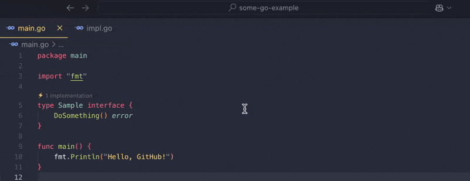

# Quick Implements


[Install through the Marketplace](https://marketplace.visualstudio.com/items?itemName=folsom-sh.quick-implements)

Quickly view and navigate to interface/abstract class implementations with an inline indicator in Visual Studio Code.

## Features



- Displays an inline indicator showing the number of implementations for interfaces and abstract classes.
- Supports multiple languages including Go, Java, TypeScript, C#, Python, and Rust.
- Allows quick navigation to the implementations via a quick pick menu.

## Usage

1. Open a file in one of the supported languages (Go, Java, TypeScript, C#, Python, Rust).
2. You will see an inline indicator showing the number of implementations for interfaces and abstract classes.
3. Click on the indicator to open a quick pick menu with the list of implementations.
4. Select an implementation from the list to navigate to its location in the code.

## Development

1. Clone the repository:
    ```sh
    git clone https://github.com/ryanfolsom/quick-implements.git
    cd quick-implements
    ```

2. Install dependencies:
    ```sh
    npm install
    ```

3. Make your changes.

4. Compile the extension:
    ```sh
    npm run compile
    ```

5. Package the extension
    ```sh
    vsce package
    ```

6. Install the extension and test
    ```sh
    code --install-extension quick-implements-VERSION.vsix
    ```
